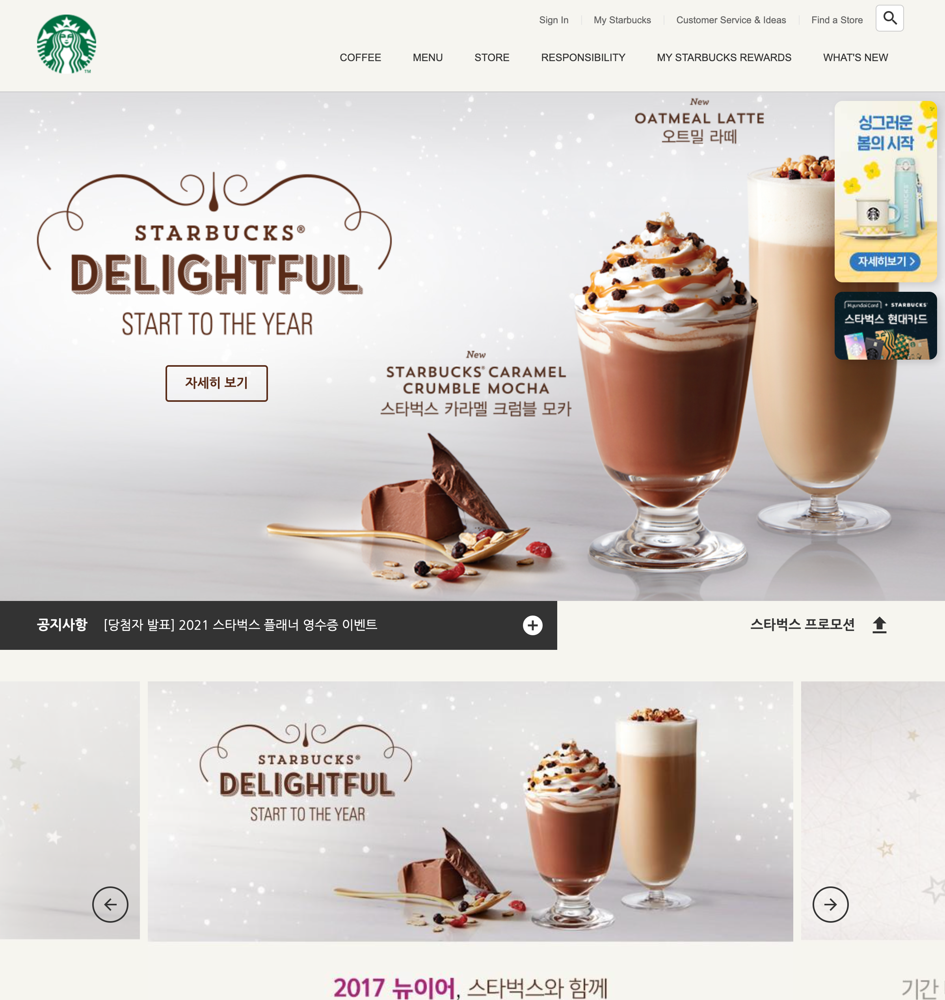

# Starbucks Clone

A simple clone of the Starbucks Korea website built using HTML, CSS, and JavaScript.



## 🚀 프로젝트 소개

이 프로젝트는 Starbucks Korea 홈페이지의 UI를 클론한 웹사이트입니다. HTML, CSS, JavaScript만을 사용해 정적인 웹사이트 구조와 애니메이션 등을 구현했습니다.

## 🛠 기술 스택

- HTML5  
- CSS3 (Flexbox, Animation)  
- JavaScript (Vanilla)

## 📂 폴더 구조
```bash
starbucks-clone/ 
├── css/                     # 스타일 시트 폴더 
│   └── main.css             # 전체 레이아웃 및 애니메이션 CSS 
│ 
├── images/                  # 사용된 이미지 리소스 
│   ├── badge1.png 
│   ├── badge2.png 
│   ├── coffee.png
│   ├── …                    # 스타벅스 배경 및 구성 이미지들
│
├── js/                      # 자바스크립트 파일
│   └── main.js              # 이벤트 핸들링 및 Swiper 설정 등
│
├── index.html               # 메인 페이지 (웹사이트 진입점)
├── README.md                # 프로젝트 소개 파일
```

## 📸 주요 기능

- 상단 배너 슬라이더  
- 스크롤 애니메이션  
- 섹션별 레이아웃 구성  
- 반응형 레이아웃 (선택사항)

## ✅ 실행 방법

1. 이 저장소를 클론합니다:

   ```bash
   git clone https://github.com/smyuDev/starbucks-clone.git
2.	index.html 파일을 브라우저에서 열면 바로 실행됩니다.

📌 참고
이 프로젝트는 학습 목적으로 제작된 클론코딩입니다. 실제 스타벅스 웹사이트와는 무관합니다.

📄 라이선스
이 프로젝트는 MIT 라이선스를 따릅니다.
